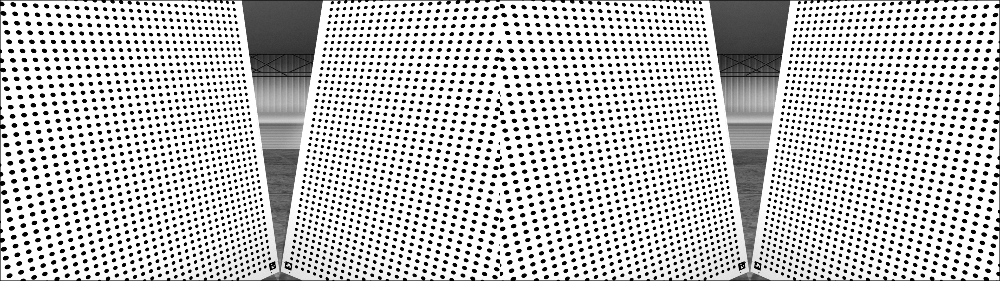
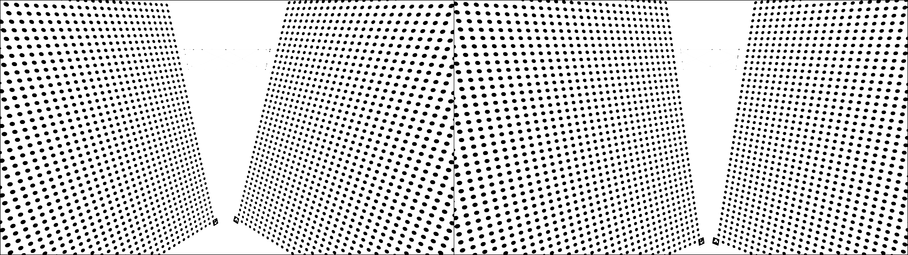
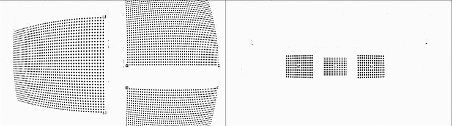
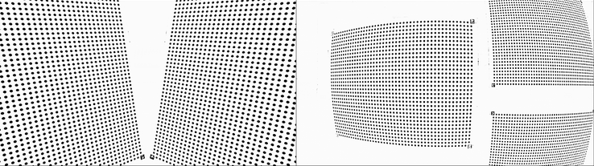

# Deep Marker Detector
A PyTorch-based project aimed at extracting the center of circular or box markers. The main goal of this project is to develop a Deep Learning (DL) based system for extracting circular markers from two-dimensional images used for camera calibration. The images used for model training come in two types, varying based on the resolution-objective parameters:

- 1920×1080 pinhole.
- 3840×1920 fisheye.

The project consists of the following Python modules:

- `main.py` and `main_collate.py`: These modules are responsible for launching the simulation. They use other modules, including:
  (i) Modules for handling training/validation data.
  (ii) Modules for training and validation.
  The file main_collate.py is used to train the model using images with different resolution (1920×1080 and 3840×1080).

- `custom_dataset.py`: This module is responsible for generating dataloaders for training and validation.

- `metrics.py`: This module contains various metrics and loss functions used during training and validation.

- `models.py`: This module contains implementations of the CAE network architecture.

- `plotting_utils.py`: This module contains several useful functions for plotting metrics and results.

- `solver.py`: This module includes various methods for training and validation. It also provides functionality for saving and loading the model.

- `pytorchtools.py`: This module includes an early stopping mechanism implementation.

The **results** are contained within the `results/visione_artificiale_veicolo_report.pdf` file.

## Some results:






## The parameters that can be provided through the command line and allow customization of the execution are:

| Argument              | Description                                                                  |
|-----------------------|------------------------------------------------------------------------------|
| run_name              | The name assigned to the current run                                         |
| model_name            | The name of the model to be saved or loaded                                  |
| num_epochs            | The total number of training epochs                                          |
| select_model          | Select the model to train                                                    |
| batch_size            | The batch size for training/validation data                                  |
| workers               | The number of workers in the data loader                                     |
| random_seed           | The random seed used to ensure reproducibility                               |
| lr                    | The learning rate for optimization                                           |
| loss                  | The loss function used for model optimization                                |
| opt                   | The optimizer used for training                                              |
| patience              | The threshold for early stopping during training                             |
| load_model            | Determines whether to load the model from a checkpoint                       |
| dataset_path          | The path to save or retrieve the dataset                                     |
| checkpoint_path       | The path to save the trained model                                           | 
| norm_input            | Indicates whether to normalize the input data                                |
| apply_transformations | Indicates whether to apply transformations to images and corresponding masks |


### Prerequisites

- [Python](https://www.python.org/downloads/) 3.5 or later installed on your system.
- The following modules:
  - [os](https://docs.python.org/3/library/os.html)
  - [json](https://docs.python.org/3/library/json.html)
  - [torch](https://pytorch.org/)
  - [numpy](https://numpy.org/)
  - [tqdm](https://tqdm.github.io/)
  - [matplotlib](https://matplotlib.org/)
  - [torchvision](https://pytorch.org/vision/stable/index.html)
  - [torch.nn.utils.prune](https://pytorch.org/tutorials/intermediate/pruning_tutorial.html)
  - [cv2](https://docs.opencv.org/4.5.2/)
  - [PIL](https://pillow.readthedocs.io/en/stable/)
  - [albumentations](https://albumentations.ai/)
  - [torch.utils.data](https://pytorch.org/docs/stable/data.html)
  - [math](https://docs.python.org/3/library/math.html)
  - [random](https://docs.python.org/3/library/random.html)
  - [argparse](https://docs.python.org/3/library/argparse.html)
  - [torch.utils.tensorboard](https://pytorch.org/docs/stable/tensorboard.html)
  - [torchmetrics](https://torchmetrics.readthedocs.io/en/stable/)
  - [pandas](https://pandas.pydata.org/)
  - [torch.optim](https://pytorch.org/docs/stable/optim.html)

Make sure to install these modules using `pip` or any other package manager like `miniconda` before running the code.

- [Python](https://www.python.org/downloads/) 3.5 or later installed on your system.
- [Miniconda](https://docs.conda.io/en/latest/miniconda.html) installed on your system (optional but recommended).

### Installation

1. Clone this repository to your local machine or download the ZIP file and extract its contents.

   ```shell
   git clone https://github.com/your-username/repository-name.git
   ```

2. Navigate to the project directory.

   ```shell
   cd repository-name
   ```

3. (Optional) Create a virtual environment using Miniconda to isolate the project dependencies. If you don't have Miniconda installed, you can skip this step and proceed with the regular package installation.

   - Create a new virtual environment.

     ```shell
     conda create -n myenv python=3.9
     ```

   - Activate the virtual environment.

     - For Windows:

       ```shell
       conda activate myenv
       ```

     - For macOS/Linux:

       ```shell
       source activate myenv
       ```

4. Install the required modules.

   ```shell
   conda install -c conda-forge matplotlib pytorch numpy tqdm torchvision opencv pillow pandas
   pip install albumentations torchmetrics
   ```

5. Download the dataset.

### Usage

Once you have completed the installation steps and downloaded the dataset, you need to define the correct file paths in the main.py or main_collate.py file. Open the main.py file and modify the default value of the corresponding argparse parameter or provide the correct path through the command line to the appropriate paths to the dataset on your system.

After setting the correct file paths, you can run the `main.py` of `main_collate.py` file.

```shell
python deep-marker-detector/main.py --dataset_path ./data/1920x1080 --random_seed 1 --num_epochs 200 --loss jac_loss --select_model ConvAutoEncoder --model_name ConvAutoEncoder_experiment_1 --run_name ConvAutoEncoder_experiment_1
```

Make sure you are in the project directory and have activated your virtual environment (if applicable) before running the above command.

### Additional Notes

- Modify the `main.py` or `main_collate.py` file according to your needs or replace it with your own Python script.

Happy coding!
